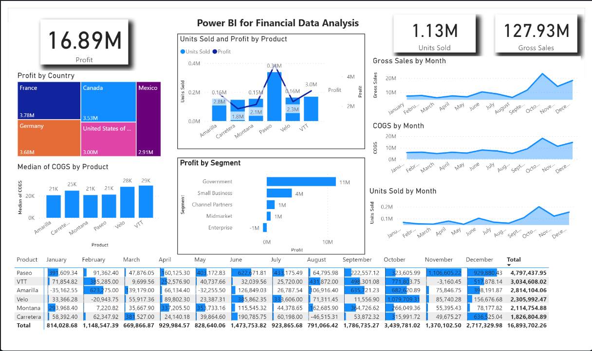
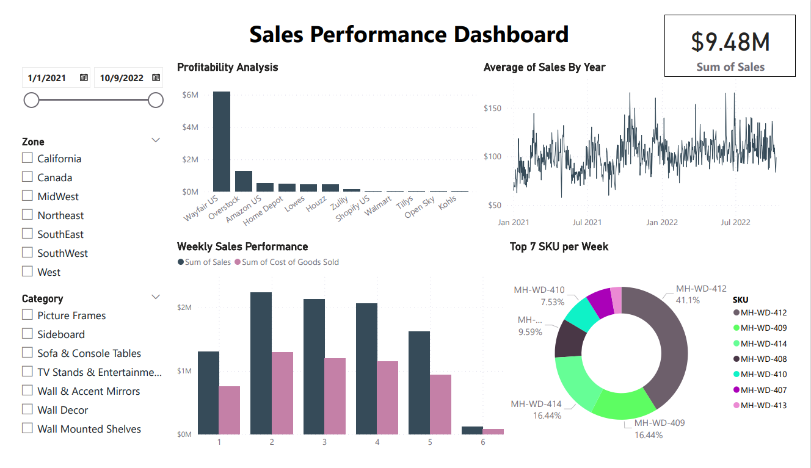

# Power BI Example Projects

### Financial Data Analysis Dashboard
View Profit by Country, Units Sold per Product, dynamic KPIs for sales, profit, and units sold  
Also, view a per month profit table for each product, and line charts for Gross Sales, COGS, and Units Sold per month

### Sales Performance Dashbboard
Dashbaord designed for the user to filter between dates, the area of sales, and the category of product and examine sales data  
More specifially the profiability, weekly sales, average of sales by year, and pertanage of each product is displayed. 

