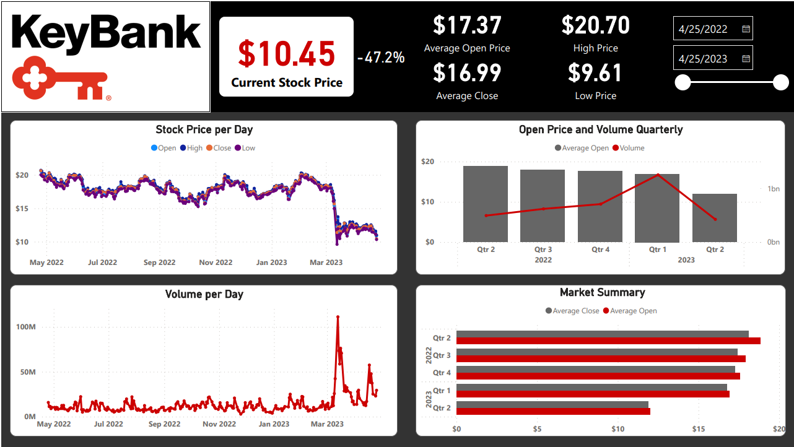

# Power BI Example Projects

### Financial Data Analysis Dashboard
View Profit by Country, Units Sold per Product, dynamic KPIs for sales, profit, and units sold  
Also, view a per month profit table for each product, and line charts for Gross Sales, COGS, and Units Sold per month

### Single Stock Historical Data Analysis Dashboard
Examine KeyCorp's stock data for the past year (April 2022-April 2023).  Dyanmic Slider and graphs to examine the trends in stock price and volume per
day in any range specified by the user.  

### Sales Performance Dashbboard
Dashbaord designed for the user to filter between dates, the area of sales, and the category of product and view resulting sales data  
Profitability, weekly sales, average of sales by year, percentage of each sold product, and the sum of sales is displayed

